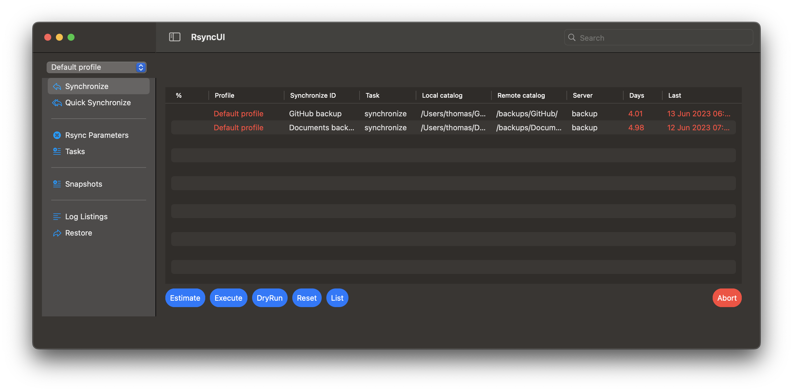
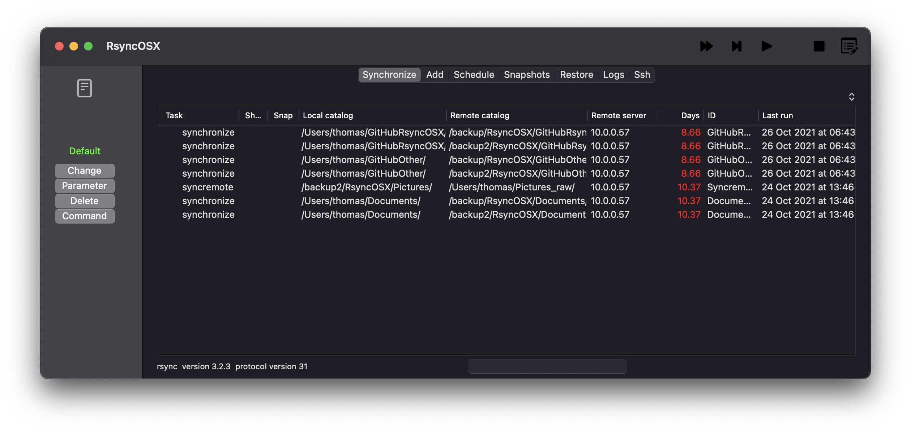

## Hi there 👋

RsyncUI and RsyncOSX are GUI´s on the Apple macOS platform for the command line tool [rsync](https://github.com/WayneD/rsync). The main difference between the two apps is how the User Interface (UI) is built. It is `rsync` which executes the synchronize data tasks in both apps. The GUI´s are only for organizing tasks, setting parameters to `rsync` and most likely make it easier to use `rsync`.

If you are on *macOS Sonoma* use RsyncUI. RsyncUI is under active development now and in the future.  There is also some high level info about [how RsyncUI is built](https://rsyncui.netlify.app/post/built/).

### Install by Homebrew

Both apps might be installed by Homebrew or by direct Download. The apps are signed and notarized by Apple.

| App      | Homebrew | macOS |  Documentation |  
| ----------- | ----------- |   ----------- |  ----------- |
| RsyncUI   | `brew install --cask rsyncui`    | macOS Sonoma   |   [rsyncui.netlify.app](https://rsyncui.netlify.app/post/rsyncuidocs/) | 
| RsyncOSX   | `brew install --cask rsyncosx`  |  macOS Big Sur and later   |  [rsyncosx.netlify.app](https://rsyncosx.netlify.app/post/rsyncosxdocs/) |

### Why two apps and latest versions

The development of RsyncOSX commenced in *2015* as a private project to learn Swift. In *2019*, Apple released SwiftUI, which is a development framework for building user interfaces for iOS, iPadOS, watchOS, TVOS, and macOS. SwiftUI quickly became very popular, and after some investigation, I decided to commence another private project to learn SwiftUI. The model part of RsyncOSX was at that time quite stable, and I decided to refactor the GUI part of RsyncOSX by utilizing SwiftUI. And that is the short story behind the two applications.

| App      | #lines  | #files | UI | Latest version  |  Version 1.0 | 
| ----------- | ----------- |   ----------- | -------- |  -------- | -------- |
| RsyncUI   | about 13.4k | 163  | SwiftUI, declarativ     | v1.8.6 - [30 January 2024](https://github.com/rsyncOSX/RsyncUI/releases)  | 6 May 2021  | 
| RsyncOSX   | about 11K | 121  | Storyboard, imperativ   | v6.8.0 - [13 April 2023](https://github.com/rsyncOSX/RsyncOSX/releases) |	14 March 2016 | 

### The future

According to Apple, SwiftUI is the future. In my own experience, coding in SwiftUI is easier and more predictable than by Storyboard and Swift, which are the basis for RsyncOSX. Both apps are maintained, but RsyncUI is the future, and new development is within RsyncUI. And with every new release of macOS, Swift and Xcode there are new exciting features in SwiftUI.

Both apps might be used in parallel, but not at the same time due to the locking of files. Data is read and updated from the same location on storage.

### Important to verify new tasks

The UI of RsyncOSX and RsyncUI can for users who dont know `rsync` be difficult to understand. Setting wrong parameters to `rsync` can result in deleted data. RsyncOSX nor RsyncUI will not stop you for doing so. That is why it is **very** important to execute a simulated run, a `--dry-run`, and verify the result before the real run.

### External task executing rsync 

Please be aware it is an external task *not controlled* by RsyncOSX or RsyncUI, which executes the command-line tool rsync. The progress and termination of the external rsync task are monitored. The user can abort the task at any time. Please let the abort finish and cleanup properly before starting a new task. It might take a few seconds. If not, the apps might become unresponsive.

### RsyncUI

   

**RsyncUI** is released for **macOS Sonoma**. Latest build is [30 January 2024](https://github.com/rsyncOSX/RsyncUI/releases).

- the [documentation of RsyncUI](https://rsyncui.netlify.app/)
- the [changelog](https://rsyncui.netlify.app/post/changelog/)

### RsyncOSX

   

**RsyncOSX** is released for **macOS Big Sur** and later. Latest build is [13 April 2023](https://github.com/rsyncOSX/RsyncOSX/releases).

- the [documentation of RsyncOSX](https://rsyncosx.netlify.app/)
- the [changelog](https://rsyncosx.netlify.app/post/changelog/)

