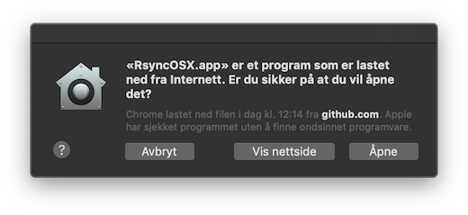

## RsyncOSX


This repository is the source code for the macOS app RsyncOSX. RsyncOSX is compiled with support for macOS El Capitan version 10.11 - macOS Mojave version 10.14. The application is implemented in Swift 4 by using Xcode 10. RsyncOSX is not depended upon any third party binary distributions. There is, however, one third party source code included to check for TCP connections. The check is for informal use only and can be removed.

Rsync is a file-based synchronization and backup tool. There is no custom solution for the backup archive. You can quit utilizing RsyncOSX (and rsync) at any time and still have access to all synchronized files.

A short [intro to RsyncOSX](https://rsyncosx.github.io/Intro) and full [documentation of RsyncOSX](https://rsyncosx.github.io/AboutRsyncOSX). About signing and notarizing of RsyncOSX see below.

From next [release](https://github.com/rsyncOSX/RsyncOSX/releases) after version 5.5.7, executing scheduled tasks is removed from RsyncOSX. Scheduled tasks are still added and deleted within RsyncOSX. Executing the scheduled tasks is by the [menu app](https://github.com/rsyncOSX/RsyncOSXsched).

## --delete parameter

**Caution** about RsyncOSX and the `--delete` parameter. The `--delete` is a [default parameter](https://rsyncosx.github.io/RsyncParameters). The parameter instructs rsync to **delete** all files in the destination which are not present in the source. Every time you add a new task to RsyncOSX, execute an estimation run (`--dry-run` parameter) and inspect the result before executing a real run. If you by accident set an empty catalog as source RsyncOSX will delete all files in the destination. To save deleted and changes files either utilize [snapshots](https://rsyncosx.github.io/Snapshots) or the `--backup` [feature](https://rsyncosx.github.io/Parameters).

## Fighting bugs

Fighting bugs are difficult. I am not able to test RsyncOSX for all possible user interactions and use. From time to time I discover new bugs. But I also need support from other users discovering bugs or not expected results. If you discover a bug **please** use the [issues](https://github.com/rsyncOSX/RsyncOSX/issues) and report it.  

The main view of RsyncOSX.

Automatic synchronizing in action.


### Signing and notarizing

The app is signed with my Apple ID developer certificate and [notarized](https://support.apple.com/en-us/HT202491) by Apple. If you have Xcode developer tools installed executing the following command `xcrun stapler validate no.blogspot.RsyncOSX RsyncOSX.app` will verify the RsyncOSX.app.
```
xcrun stapler validate no.blogspot.RsyncOSX RsyncOSX.app
Processing: /Volumes/Home/thomas/GitHub/RsyncOSX/Build/Products/Release/RsyncOSX.app
The validate action worked!
```
This is the message when opening a downloaded version.



The message is in Norwegian: "Apple har sjekket programmet uten å finne ondsinnet programvare.". The english version of it is: "Apple checked it for malicious software and none was detected.".

### About crash?

What happens if bugs occurs during execution of tasks in RsyncOSX? The command line tool `rsync` is designed to continue where rsync is by any reason, stopped or killed. Users can abort execution of tasks at any time. To continue an aborted task execute the task again and rsync will restart and complete the task. This is also true if a bug in RsyncOSX occurs during execution of a task.

If RsyncOSX does halt or crash during operation there is no damage to files or deletion of files in the `source`. The `source` is only read during `synchronize` and `snapshot` tasks.

### About restoring files to a temporary restore catalog

If you do a **restore** from the `remote` to the `source`, some files in the source might be deleted. This is due to how rsync works in `synchronize` mode. As a precaution **never** do a restore directly from the `remote` to the `source`, always do a restore to a temporary restore catalog.

### Application icon

The application icon is created by [Zsolt Sándor](https://github.com/graphis). All rights reserved to Zsolt Sándor.

### Changelog

The [Changelog](https://rsyncosx.github.io/Changelog).

### How to use RsyncOSX - YouTube videos

There are four short YouTube videos of RsyncOSX:

- [getting](https://youtu.be/MrT8NzdF9dE) RsyncOSX and installing it
  - the video also shows how to create the two local ssh certificates for password less logins to remote server
- adding and executing the [first backup](https://youtu.be/8oe1lKgiDx8)
- doing a full [restore](https://youtu.be/-R6n_8fl6Ls) to a temporary local restore catalogs
- how to change [version of rsync](https://youtu.be/mVFL25-lo6Y) utilized by RsyncOSX

### Rsync

The default version of `rsync` in macOS is old (version 2.6.9, [protocol](https://rsync.samba.org/how-rsync-works.html) version 29). Version [2.6.9](https://download.samba.org/pub/rsync/src/rsync-2.6.9-NEWS) was released in nov 2006. The current release of rsync is version [3.1.3](https://download.samba.org/pub/rsync/src/rsync-3.1.3-NEWS) protocol 31 released 28 January 2018. There are at least three options to get and install the current version of rsync for use in RsyncOSX:

- get `rsync-3.1.3.dmg` from [releases](https://github.com/rsyncOSX/RsyncOSX/releases) to install the latest version of rsync
- install Xcode and download the rsync [source](https://rsync.samba.org/) from rsync.samba.org
	- required tools are `gcc` and `make` which are part of Xcode command line tool (you might be able to install Xcode command line tool only by downloading the tools from [Apple Developer page](https://developer.apple.com/))
	- untar the [source archive](https://download.samba.org/pub/rsync/src/) and use `make` to compile and install, rsync compiles without any issues on macOS
- install [homebrew](https://en.wikipedia.org/wiki/Homebrew_(package_management_software)) and then install rsync as part of homebrew

In RsyncOSX select [user configuration](https://rsyncosx.github.io/UserConfiguration) and set path for optional version of rsync.

#### SwiftLint

As part of this version of RsyncOSX I am using [SwiftLint](https://github.com/realm/SwiftLint) as tool for writing more readable code. There are about 120 classes with 14,500 lines of code in RsyncOSX (probably too many?). I am also using Paul Taykalo´s [swift-scripts](https://github.com/PaulTaykalo/swift-scripts) to find and delete not used code.

### Compile

To compile the code, install Xcode and open the RsyncOSX project file. Before compiling, open in Xcode the `RsyncOSX/General` preference page (after opening the RsyncOSX project file) and replace your own credentials in `Signing`, or disable Signing.

There are two ways to compile, either utilize `make` or compile by Xcode. `make release` will compile the `RsyncOSX.app` and `make dmg` will make a dmg file to be released.  The build of dmg files are by utilizing [andreyvit](https://github.com/andreyvit/create-dmg) script for creating dmg and [syncthing-macos](https://github.com/syncthing/syncthing-macos) setup.

### Development

Details about how RsyncOSX is [built](https://rsyncosx.github.io/Source).

### MacUpdate and Softpedia

RsyncOSX is also released on [MacUpdate](https://www.macupdate.com/app/mac/56516/rsyncosx) and linked for download on [Softpedia](http://mac.softpedia.com/get/Internet-Utilities/RsyncOSX.shtml) as well.

### My NAS setup

I have setup up my own [NAS](https://rsyncosx.github.io/DIYNAS). My NAS SW is now FreeNAS. I am doing backups by using RsyncOSX and sharing out disk by AFP and SMB.

#### RcloneOSX

I have commenced a new project, the new project [RcloneOSX](https://github.com/rsyncOSX/rcloneosx) is adapting RsyncOSX to utilize [rclone](https://rclone.org). See the [Changelog](https://rsyncosx.github.io/RcloneChangelog) for the new project.
