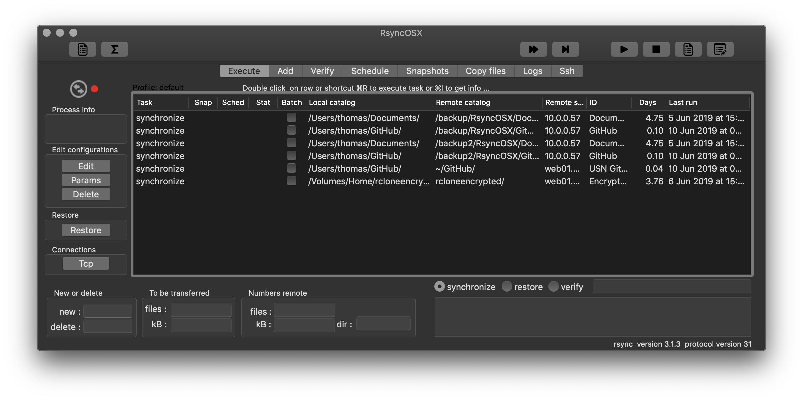
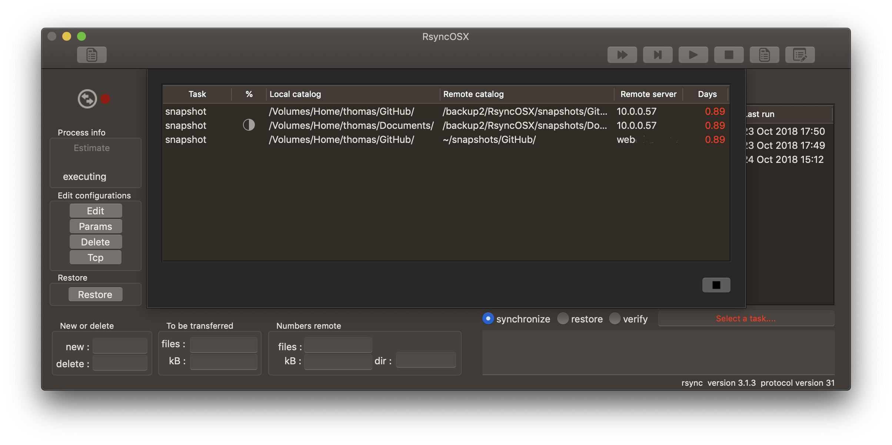

## RsyncOSX

 [The Changelog](https://rsyncosx.netlify.app/post/changelog/).

[](https://github.com/rsyncOSX/RsyncOSX/blob/master/Licence.MD)   [](https://crowdin.com/project/rsyncosx) [](https://app.netlify.com/sites/rsyncosx/deploys)

If you want to discuss [changes or report bugs please create an issue](https://github.com/rsyncOSX/RsyncOSX/issues).

**Read about the --delete parameter** (below) to rsync **before** using rsync and RsyncOSX.

There are some [docs about RsyncOSX, RsynGUI and RcloneOSX](https://rsyncosx.netlify.app/). The docs are based on Hugo, [the Hugo Theme Even](https://github.com/olOwOlo/hugo-theme-even), Markdown and published on Netlify.

RsyncOSX is a GUI on top of the command line utility `rsync`. Rsync is a file-based synchronization and backup tool. There is no custom solution for the backup archive. You can quit utilizing RsyncOSX (and rsync) at any time and still have access to all synchronized files.

RsyncOSX is compiled with support for **macOS El Capitan version 10.11 - macOS Catalina version 10.15**. The application is implemented in pure Swift 5, Cocoa and Foundation. RsyncOSX is not depended upon any third party binary distributions.

### Dependencies

 From the latest release there are two source code dependencies:

- check for TCP connectivity by utilizing [SwiftSocket](https://github.com/swiftsocket/SwiftSocket), some functions require connections to remote servers
- execute pre and post shellscripts by utilizing John Sundell´s [ShellOut](https://github.com/JohnSundell/ShellOut)

Both are available as source code and automatically included as part of building RsyncOSX.

### Scheduling

Scheduled tasks are added and deleted within RsyncOSX. Executing the scheduled tasks is by the [menu app](https://rsyncosx.netlify.app/post/menuapp/).

### Remote servers

If destination is a **remote server**, RsyncOSX is dependent on [setting up password-less logins](https://rsyncosx.netlify.app/post/remotelogins/). Both ssh-keys and rsync daemon setup are possible. It is advised utilizing ssh-keys because communication between source and destination (client and server) is encrypted.

If destination is a **local attached volume**, the above is not relevant.

### Signing and notarizing

The app is signed with my Apple ID developer certificate and [notarized](https://support.apple.com/en-us/HT202491) by Apple. See [signing and notarizing](https://rsyncosx.netlify.app/post/notarized/) for info. Signing and notarizing is required to run on macOS Catalina.

### Localization

[RsyncOSX speaks new languages](https://rsyncosx.netlify.app/post/localization/). RsyncOSX is localized to:
- Chinese (Simplified) -  by [StringKe](https://github.com/StringKe)
- German - by [Andre](https://github.com/andre68723)
- French - translated by [crowdin](https://crowdin.com/project/rsyncosx)
- Norwegian - by me
- English - the base language of RsyncOSX
- Italian - by [Stefano Steve Cutelle'](https://github.com/stefanocutelle)

Localization is done by utilizing [Crowdin](https://crowdin.com/project/rsyncosx) to translate the xliff files which are imported into Xcode after translating. Xcode then creates the required language strings. [Crowdin is free for open source projects](https://crowdin.com/page/open-source-project-setup-request).

### Version of rsync

RsyncOSX is verified with rsync versions 2.6.9, 3.1.2, 3.1.3 and 3.2.x. Other versions of rsync will work but numbers about transferred files is not set in logs. It is recommended to [install](https://rsyncosx.netlify.app/post/rsync/) the latest version of rsync.

If you are only looking for utilizing stock version of rsync (version 2.6.9) and only synchronize data to either local attached disks or remote servers, [there is a minor version (RsynGUI) available on Mac App Store](https://itunes.apple.com/us/app/rsyncgui/id1449707783?l=nb&ls=1&mt=12). RsyncGUI does **not** support snapshots or scheduling task.

### Some words about RsyncOSX

RsyncOSX is not developed to be an easy to use synchronize and backup tool. The main purpose is to assist and ease the use of `rsync` to synchronize files on your Mac to remote FreeBSD and Linux servers. And of course restore files from those remote servers.

The UI can for users who dont know `rsync`, be difficult or complex to understand. It is not required to know `rsync` but it will ease the use and understanding of RsyncOSX. But it is though, possible to use RsyncOSX by just adding a source and remote backup catalog using default parameters.

RsyncOSX supports synchronize and snapshots of files.

If your plan is to use RsyncOSX as your main tool for backup of files, please investigate and understand the limits of it. RsyncOSX is quite powerful, but it is might not the primary backup tool for the average user of macOS.

There is a [short intro to RsyncOSX](https://rsyncosx.netlify.app/post/intro/) and [some more documentation of RsyncOSX](https://rsyncosx.netlify.app/post/rsyncosxdocs/).

### The --delete parameter
```
Caution about RsyncOSX and the `--delete` parameter. The `--delete` is a default parameter.
The parameter instructs rsync to keep the source and destination synchronized (in sync).
The parameter instructs rsync to delete all files in the destination which are not present
in the source.

Every time you add a new task to RsyncOSX, execute an estimation run (--dry-run) and inspect
the result before executing a real run. If you by accident set an empty catalog as source
RsyncOSX (rsync) will delete all files in the destination.
```
To save deleted and changes files either utilize [snapshots](https://rsyncosx.netlify.app/post/snapshots/)
or [the --backup parameter](https://rsyncosx.netlify.app/post/userparameters/). The --delete parameter and other default parameters might be deleted if wanted.

### Main view

The main view of RsyncOSX.

Prepare for synchronizing tasks.


### The source code and compile

There are [some details about source and how to compile](https://rsyncosx.netlify.app/post/compile/).

### A Sandboxed version

[There is also released a minor version, RsyncGUI](https://itunes.apple.com/us/app/rsyncgui/id1449707783?l=nb&ls=1&mt=12) of RsyncOSX on Apple Mac App Store. See the [changelog](https://rsyncosx.netlify.app/post/rsyncguichangelog/). RsyncGUI utilizes stock version of rsync in macOS and RsyncGUI only supports synchronize task (no snapshots).

### About bugs?

 Over the years most bugs are smoked out. Thanks to users who reports bugs. Fighting bugs are difficult. I am not able to test RsyncOSX for all possible user interactions and use. I need support from other users discovering bugs or not expected results. If you discover a bug [please report it](https://github.com/rsyncOSX/RsyncOSX/issues).

### About restoring files to a temporary restore catalog

If you do a restore from the `remote` to the `source`, some files in the source might be deleted. This is due to how rsync works in `synchronize` mode. As a precaution **never** do a restore directly from the `remote` to the `source`, always do a restore to a temporary restore catalog.

### Application icon

The application icon is created by [Zsolt Sándor](https://github.com/graphis). All rights reserved to Zsolt Sándor.

### How to use RsyncOSX - YouTube videos

There are two short YouTube videos of RsyncOSX:

- [getting RsyncOSX](https://youtu.be/MrT8NzdF9dE) and installing it
  - the video also shows how to create the two local ssh certificates for password less logins to remote server
- [adding and executing the first backup](https://youtu.be/8oe1lKgiDx8)

### XCTest

XCTest configurations are in [development](https://github.com/rsyncOSX/RsyncOSX/blob/master/XCTestconfiguration/XCTest.md).
