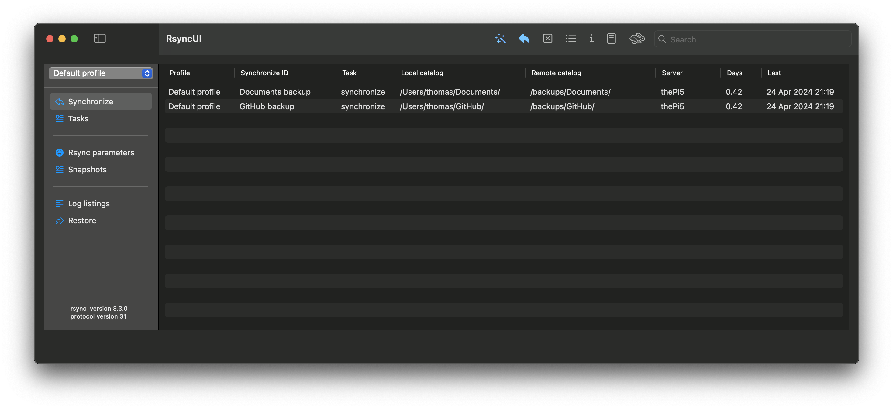

## Hi there 👋

     

I am the developer of some GUI´s for `rsync` for the Apple macOS plattform.

[ 

RsyncOSX which are released for macOS Catalina 10.15 and later versions of macOS.

  - [the documentation of RsyncOSX](https://rsyncosx.netlify.app/)
  - [the readme for RsyncOSX](https://github.com/rsyncOSX/RsyncOSX/RsyncOSX.md)

RsyncUI which are released for macOS Big Sur and later versions of macOS. This project is still in development and is the next version of RsyncOSX based on SwiftUI.

  - [the documentation of RsyncUI](https://rsyncui.netlify.app/)
  - [the readme for RsyncUI](https://github.com/rsyncOSX/RsyncUI/RsyncUI.md)
